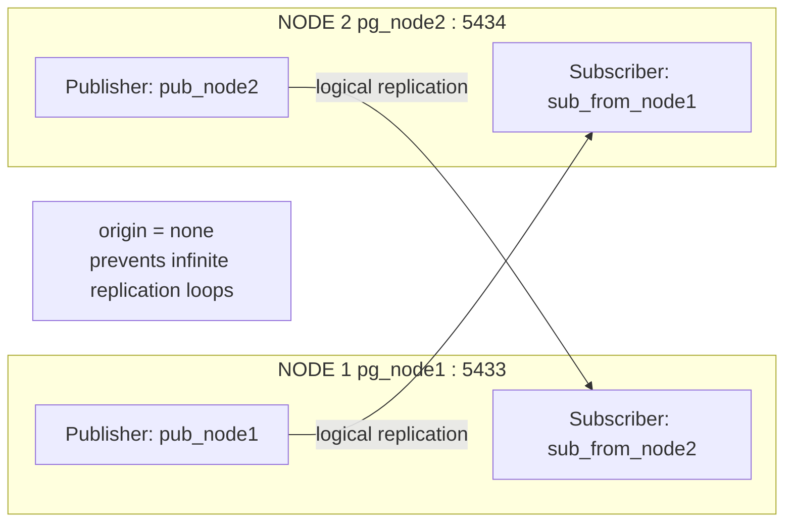

# PostgreSQL 19 Beta — Bidirectional Logical Replication on Podman (Rootless)

> **Proof of Concept**: Native bidirectional (multi-master) logical replication using **PostgreSQL 19 Beta 3**, run as two independently-created **rootless Podman** containers — no `podman-compose`, no `docker-compose.yml`, no `sudo`. Demonstrated on a banking schema (`customers`, `accounts`, `transactions`).
>
> **Status: tested end-to-end and confirmed working** on rootless Podman / WSL2 Ubuntu.

---

## Table of Contents

- [Overview](#overview)
- [How It Works](#how-it-works)
- [Prerequisites](#prerequisites)
- [Project Structure](#project-structure)
- [Step 1 — Project Folder](#step-1--project-folder)
- [Step 2 — Podman Network](#step-2--podman-network)
- [Step 3 — Pull the PostgreSQL Image](#step-3--pull-the-postgresql-image)
- [Step 4 — Create and Start the Containers](#step-4--create-and-start-the-containers)
- [Step 5 — Create the Banking Schema](#step-5--create-the-banking-schema)
- [Step 6 — Grant Replication Role](#step-6--grant-replication-role)
- [Step 7 — Create Publications](#step-7--create-publications)
- [Step 8 — Create Subscriptions](#step-8--create-subscriptions)
- [Step 9 — Verify Replication is Active](#step-9--verify-replication-is-active)
- [Step 10 — Automated Test Suite](#step-10--automated-test-suite)
- [Step 11 — Manual Two-Terminal Demo](#step-11--manual-two-terminal-demo)
- [Step 12 — Monitoring, Including Cross-Node LSN Comparison](#step-12--monitoring-including-cross-node-lsn-comparison)
- [Step 13 — Adding a New Table to Replication](#step-13--adding-a-new-table-to-replication)
- [Cheat Sheet](#cheat-sheet)
- [Step 14 — Clean Teardown](#step-14--clean-teardown)
- [Key Concepts](#key-concepts)
- [Caveats & Production Considerations](#caveats--production-considerations)
- [Notes: Scope, Real-World Use Cases, and HA](#notes-scope-real-world-use-cases-and-ha)
- [References](#references)
- [Author](#author)

---

## Overview

PostgreSQL **native bidirectional logical replication** was introduced in **PostgreSQL 16** via the `origin` parameter on `CREATE SUBSCRIPTION`. Before that, two-way replication caused infinite loops — each node would reapply replicated rows without knowing whether the change originated locally or arrived from its peer.

The fix: `origin = none` tells each subscriber to accept only changes that originated **locally** on its peer, and never re-forward rows it received via replication — breaking the loop.



---

## How It Works

| Component | Role |
|-----------|------|
| `pub_node1` | Node1 publishes its own local writes |
| `pub_node2` | Node2 publishes its own local writes |
| `sub_from_node2` on Node1 | Node1 subscribes to Node2's changes |
| `sub_from_node1` on Node2 | Node2 subscribes to Node1's changes |
| `origin = none` | Each subscriber replicates only rows that originated locally on the peer, never rows the peer itself received via replication — prevents echo/loop |
| UUID primary keys | `gen_random_uuid()` guarantees no primary-key collisions between two nodes writing independently |
| Podman user network | Lets `pg_node1` and `pg_node2` resolve each other by container name |

---

## Prerequisites

- **Podman** on WSL2 Ubuntu, running **rootless** (no `sudo` used anywhere in this guide)
- Your user mapped in `/etc/subuid` and `/etc/subgid` with a real UID/GID range — check with:
  ```bash
  podman unshare cat /proc/self/uid_map
  cat /etc/subuid
  cat /etc/subgid
  ```
- Internet access to pull `docker.io/library/postgres:19beta3` from Docker Hub
- **Fully-qualified image names** are used throughout (`docker.io/library/postgres:19beta3`, not the short form `postgres:19beta3`) so the guide works regardless of how `/etc/containers/registries.conf` is set up on a given machine

> ⚠️ **PostgreSQL 19 is Beta software. Do not use in production.**

---

## Project Structure

Everything lives under one folder so a single `rm -rf` at the end leaves no trace:

```
pg19-bidir-podman/
├── scripts/
│   ├── 01-create-network.sh
│   ├── 02-run-node1.sh
│   ├── 03-run-node2.sh
│   ├── 04-create-schema.sh
│   ├── 05-grant-replication.sh
│   ├── 06-create-publications.sh
│   ├── 07-create-subscriptions.sh
│   ├── 08-verify-replication.sh
│   ├── 09-test-bidirectional.sh
│   ├── 10-monitor.sh
│   ├── 11-add-table.sh
│   └── 99-cleanup.sh
└── README.md
```

No `docker-compose.yml` / `podman-compose.yml` anywhere — every container is created with its own standalone `podman run`.

---

## Step 1 — Project Folder

```bash
mkdir -p ~/pg19-bidir-podman/scripts
cd ~/pg19-bidir-podman
```

All scripts are generated with `cat <<'EOF'` heredocs into `scripts/`, made executable, then run.

---

## Step 2 — Podman Network

Since we're not using compose, the network is created explicitly so both containers can reach each other by name.

```bash
cat <<'EOF' > scripts/01-create-network.sh
#!/usr/bin/env bash
set -e
podman network create pgnet
echo "Network 'pgnet' created."
EOF
chmod +x scripts/01-create-network.sh
./scripts/01-create-network.sh
```

---

## Step 3 — Pull the PostgreSQL Image

Pull explicitly with the fully-qualified name before creating any containers.

```bash
podman pull docker.io/library/postgres:19beta3
podman images
```

---

## Step 4 — Create and Start the Containers

Each container gets its own standalone script.

```bash
cat <<'EOF' > scripts/02-run-node1.sh
#!/usr/bin/env bash
set -e
podman run -d \
  --name pg_node1 \
  --network pgnet \
  -e POSTGRES_USER=pguser \
  -e POSTGRES_PASSWORD=pgpass \
  -e POSTGRES_DB=bankdb \
  -p 5433:5432 \
  docker.io/library/postgres:19beta3 \
  postgres \
    -c wal_level=logical \
    -c max_replication_slots=10 \
    -c max_wal_senders=10
echo "pg_node1 started."
EOF
chmod +x scripts/02-run-node1.sh
```

```bash
cat <<'EOF' > scripts/03-run-node2.sh
#!/usr/bin/env bash
set -e
podman run -d \
  --name pg_node2 \
  --network pgnet \
  -e POSTGRES_USER=pguser \
  -e POSTGRES_PASSWORD=pgpass \
  -e POSTGRES_DB=bankdb \
  -p 5434:5432 \
  docker.io/library/postgres:19beta3 \
  postgres \
    -c wal_level=logical \
    -c max_replication_slots=10 \
    -c max_wal_senders=10
echo "pg_node2 started."
EOF
chmod +x scripts/03-run-node2.sh
```

```bash
./scripts/02-run-node1.sh
./scripts/03-run-node2.sh
sleep 5
podman ps
```

Expected output:
```
CONTAINER ID  IMAGE                                PORTS                   NAMES
xxxxxxxxxxxx  docker.io/library/postgres:19beta3  0.0.0.0:5433->5432/tcp  pg_node1
xxxxxxxxxxxx  docker.io/library/postgres:19beta3  0.0.0.0:5434->5432/tcp  pg_node2
```

---

## Step 5 — Create the Banking Schema

Run on **both nodes**. UUID primary keys avoid sequence collisions between two nodes writing independently. `gen_random_uuid()` is a built-in core function since PostgreSQL 13, so **no extension is required** — `pgcrypto` is intentionally left out.

```bash
cat <<'EOF' > scripts/04-create-schema.sh
#!/usr/bin/env bash
set -e

SCHEMA_SQL="
CREATE TABLE customers (
  id         UUID PRIMARY KEY DEFAULT gen_random_uuid(),
  full_name  TEXT NOT NULL,
  email      TEXT UNIQUE NOT NULL,
  phone      TEXT,
  created_at TIMESTAMPTZ DEFAULT now()
);

CREATE TABLE accounts (
  id          UUID PRIMARY KEY DEFAULT gen_random_uuid(),
  customer_id UUID NOT NULL REFERENCES customers(id),
  account_no  TEXT UNIQUE NOT NULL,
  balance     NUMERIC(15,2) DEFAULT 0.00,
  created_at  TIMESTAMPTZ DEFAULT now()
);

CREATE TABLE transactions (
  id          UUID PRIMARY KEY DEFAULT gen_random_uuid(),
  account_id  UUID NOT NULL REFERENCES accounts(id),
  txn_type    TEXT NOT NULL CHECK (txn_type IN ('CREDIT','DEBIT')),
  amount      NUMERIC(15,2) NOT NULL,
  description TEXT,
  txn_at      TIMESTAMPTZ DEFAULT now()
);
"

echo "--- Creating schema on Node1 ---"
podman exec -i pg_node1 psql -U pguser -d bankdb -c "$SCHEMA_SQL"

echo "--- Creating schema on Node2 ---"
podman exec -i pg_node2 psql -U pguser -d bankdb -c "$SCHEMA_SQL"
EOF
chmod +x scripts/04-create-schema.sh
./scripts/04-create-schema.sh
```

---

## Step 6 — Grant Replication Role

```bash
cat <<'EOF' > scripts/05-grant-replication.sh
#!/usr/bin/env bash
set -e
podman exec -i pg_node1 psql -U pguser -d bankdb -c "ALTER ROLE pguser REPLICATION LOGIN;"
podman exec -i pg_node2 psql -U pguser -d bankdb -c "ALTER ROLE pguser REPLICATION LOGIN;"
EOF
chmod +x scripts/05-grant-replication.sh
./scripts/05-grant-replication.sh
```

---

## Step 7 — Create Publications

```bash
cat <<'EOF' > scripts/06-create-publications.sh
#!/usr/bin/env bash
set -e
podman exec -i pg_node1 psql -U pguser -d bankdb -c \
  "CREATE PUBLICATION pub_node1 FOR TABLE customers, accounts, transactions;"

podman exec -i pg_node2 psql -U pguser -d bankdb -c \
  "CREATE PUBLICATION pub_node2 FOR TABLE customers, accounts, transactions;"
EOF
chmod +x scripts/06-create-publications.sh
./scripts/06-create-publications.sh
```

---

## Step 8 — Create Subscriptions

`origin = none` prevents infinite replication loops. `copy_data = false` because tables are empty at this point. The connection string uses the container **name** (`pg_node2` / `pg_node1`), which resolves because both containers share the `pgnet` network.

```bash
cat <<'EOF' > scripts/07-create-subscriptions.sh
#!/usr/bin/env bash
set -e

echo "--- Node1 subscribes to Node2 ---"
podman exec -i pg_node1 psql -U pguser -d bankdb -c "
CREATE SUBSCRIPTION sub_from_node2
  CONNECTION 'host=pg_node2 port=5432 user=pguser password=pgpass dbname=bankdb'
  PUBLICATION pub_node2
  WITH (origin = none, copy_data = false);
"

echo "--- Node2 subscribes to Node1 ---"
podman exec -i pg_node2 psql -U pguser -d bankdb -c "
CREATE SUBSCRIPTION sub_from_node1
  CONNECTION 'host=pg_node1 port=5432 user=pguser password=pgpass dbname=bankdb'
  PUBLICATION pub_node1
  WITH (origin = none, copy_data = false);
"
EOF
chmod +x scripts/07-create-subscriptions.sh
./scripts/07-create-subscriptions.sh
```

---

## Step 9 — Verify Replication is Active

```bash
cat <<'EOF' > scripts/08-verify-replication.sh
#!/usr/bin/env bash
set -e

echo "=== Node1 subscriptions ==="
podman exec -i pg_node1 psql -U pguser -d bankdb -c \
  "SELECT subname, subenabled FROM pg_subscription;"

echo "=== Node2 subscriptions ==="
podman exec -i pg_node2 psql -U pguser -d bankdb -c \
  "SELECT subname, subenabled FROM pg_subscription;"

echo "=== Node1 replication slots ==="
podman exec -i pg_node1 psql -U pguser -d bankdb -c \
  "SELECT slot_name, active FROM pg_replication_slots;"

echo "=== Node2 replication slots ==="
podman exec -i pg_node2 psql -U pguser -d bankdb -c \
  "SELECT slot_name, active FROM pg_replication_slots;"
EOF
chmod +x scripts/08-verify-replication.sh
./scripts/08-verify-replication.sh
```

Expected — all subscriptions `subenabled = t`, all slots `active = t`.

---

## Step 10 — Automated Test Suite

Four tests in sequence: insert on Node1 → verify on Node2, insert on Node2 → verify on Node1, simultaneous inserts on both, and a cross-node account + transaction ledger check.

```bash
cat <<'EOF' > scripts/09-test-bidirectional.sh
#!/usr/bin/env bash
set -e

echo "### TEST 1 — Insert customer on Node1, verify on Node2 ###"
echo "--- [NODE1] Register customer: Clement ---"
podman exec -i pg_node1 psql -U pguser -d bankdb -c "
INSERT INTO customers (full_name, email, phone)
VALUES ('Clement', 'clement@bank.com', '+91-9000000001');
"
sleep 1
echo "--- [NODE2] Should see Clement ---"
podman exec -i pg_node2 psql -U pguser -d bankdb -c \
  "SELECT full_name, email FROM customers ORDER BY full_name;"

echo "### TEST 2 — Insert customer on Node2, verify on Node1 ###"
echo "--- [NODE2] Register customer: Colin ---"
podman exec -i pg_node2 psql -U pguser -d bankdb -c "
INSERT INTO customers (full_name, email, phone)
VALUES ('Colin', 'colin@bank.com', '+91-9000000002');
"
sleep 1
echo "--- [NODE1] Should see Clement + Colin ---"
podman exec -i pg_node1 psql -U pguser -d bankdb -c \
  "SELECT full_name, email FROM customers ORDER BY full_name;"

echo "### TEST 3 — Simultaneous inserts on both nodes ###"
echo "--- [NODE1 + NODE2] Register Shruti and Sindhu simultaneously ---"
podman exec -i pg_node1 psql -U pguser -d bankdb -c "
INSERT INTO customers (full_name, email, phone)
VALUES ('Shruti', 'shruti@bank.com', '+91-9000000003');
" &
podman exec -i pg_node2 psql -U pguser -d bankdb -c "
INSERT INTO customers (full_name, email, phone)
VALUES ('Sindhu', 'sindhu@bank.com', '+91-9000000004');
" &
wait
sleep 2
echo "--- [NODE1] Final: should show all 4 customers ---"
podman exec -i pg_node1 psql -U pguser -d bankdb -c \
  "SELECT full_name, email FROM customers ORDER BY full_name;"
echo "--- [NODE2] Final: should show all 4 customers ---"
podman exec -i pg_node2 psql -U pguser -d bankdb -c \
  "SELECT full_name, email FROM customers ORDER BY full_name;"

echo "### TEST 4 — Account + Transaction across nodes ###"
echo "--- [NODE1] Open account for Clement ---"
podman exec -i pg_node1 psql -U pguser -d bankdb -c "
INSERT INTO accounts (customer_id, account_no, balance)
SELECT id, 'ACC-CLEMENT-001', 50000.00
FROM customers WHERE email = 'clement@bank.com';
"
sleep 1
echo "--- [NODE2] Credit transaction for Clement's account (from Node2 branch) ---"
podman exec -i pg_node2 psql -U pguser -d bankdb -c "
INSERT INTO transactions (account_id, txn_type, amount, description)
SELECT id, 'CREDIT', 10000.00, 'Salary credit - test run'
FROM accounts WHERE account_no = 'ACC-CLEMENT-001';
"
sleep 1
echo "--- [NODE1] Full ledger view ---"
podman exec -i pg_node1 psql -U pguser -d bankdb -c "
SELECT c.full_name, a.account_no, a.balance, t.txn_type, t.amount, t.description, t.txn_at
FROM transactions t
JOIN accounts a ON t.account_id = a.id
JOIN customers c ON a.customer_id = c.id
ORDER BY t.txn_at;
"
EOF
chmod +x scripts/09-test-bidirectional.sh
./scripts/09-test-bidirectional.sh
```

Expected on **both nodes** after Test 3:
```
 full_name | email
-----------+---------------------
 Clement   | clement@bank.com
 Colin     | colin@bank.com
 Shruti    | shruti@bank.com
 Sindhu    | sindhu@bank.com
```

---

## Step 11 — Manual Two-Terminal Demo

The automated script proves replication works, but seeing it happen live in two interactive `psql` sessions makes the "which node did this originate on" story concrete. Open **two terminal windows** side by side. This demo covers all three of INSERT, UPDATE, and DELETE, in both directions.

**Terminal A — attach to Node1's interactive psql shell:**

```bash
podman exec -it pg_node1 psql -U pguser -d bankdb
```

**Terminal B — attach to Node2's interactive psql shell:**

```bash
podman exec -it pg_node2 psql -U pguser -d bankdb
```

Keep both sessions open for everything below.

### INSERT — Node1 → Node2

**Terminal A (Node1):**
```sql
INSERT INTO customers (full_name, email, phone)
VALUES ('Ravi', 'ravi@bank.com', '+91-9000000005');

SELECT full_name, email FROM customers ORDER BY full_name;
```

**Terminal B (Node2)**, after a second or two:
```sql
SELECT full_name, email FROM customers ORDER BY full_name;
```

Ravi should appear on Node2 with no script driving it — you typed the SQL by hand on one node and watched it arrive on the other.

### INSERT — Node2 → Node1

**Terminal B (Node2):**
```sql
INSERT INTO customers (full_name, email, phone)
VALUES ('Meera', 'meera@bank.com', '+91-9000000006');
```

**Terminal A (Node1):**
```sql
SELECT full_name, email FROM customers ORDER BY full_name;
```

Meera should now show up on Node1.

### UPDATE — Node1 → Node2

**Terminal A (Node1)** — update Ravi's phone number:
```sql
UPDATE customers
SET phone = '+91-9000009999'
WHERE email = 'ravi@bank.com';

SELECT full_name, phone FROM customers WHERE email = 'ravi@bank.com';
```

**Terminal B (Node2)**, after a second or two:
```sql
SELECT full_name, phone FROM customers WHERE email = 'ravi@bank.com';
```

The updated phone number should reflect on Node2 automatically.

### UPDATE — Node2 → Node1

**Terminal B (Node2)** — update Meera's phone number instead:
```sql
UPDATE customers
SET phone = '+91-9000008888'
WHERE email = 'meera@bank.com';
```

**Terminal A (Node1):**
```sql
SELECT full_name, phone FROM customers WHERE email = 'meera@bank.com';
```

### DELETE — Node1 → Node2

**Terminal A (Node1)** — remove Ravi:
```sql
DELETE FROM customers WHERE email = 'ravi@bank.com';

SELECT full_name, email FROM customers ORDER BY full_name;
```

**Terminal B (Node2)**, after a second or two:
```sql
SELECT full_name, email FROM customers ORDER BY full_name;
```

Ravi should be gone from Node2 as well.

### DELETE — Node2 → Node1

**Terminal B (Node2)** — remove Meera:
```sql
DELETE FROM customers WHERE email = 'meera@bank.com';
```

**Terminal A (Node1):**
```sql
SELECT full_name, email FROM customers ORDER BY full_name;
```

Meera should be gone from Node1 too. Both sessions can stay open indefinitely — exit either with `\q` when done.

---

## Step 12 — Monitoring, Including Cross-Node LSN Comparison

Beyond checking that subscriptions are `active`, the real proof that both directions are caught up is comparing **LSNs (Log Sequence Numbers)** across the two nodes — a publisher's "how far I've sent" should line up with the subscriber's "how far I've received."

```bash
cat <<'EOF' > scripts/10-monitor.sh
#!/usr/bin/env bash
set -e

echo "=== Node1: current WAL position (what Node1 has written locally) ==="
podman exec -i pg_node1 psql -U pguser -d bankdb -c "SELECT pg_current_wal_lsn();"

echo "=== Node1: outgoing replication to Node2 (publisher side) ==="
podman exec -i pg_node1 psql -U pguser -d bankdb -c "
SELECT application_name, state, sent_lsn, write_lsn, flush_lsn, replay_lsn
FROM pg_stat_replication;
"

echo "=== Node2: incoming subscription from Node1 (subscriber side) ==="
podman exec -i pg_node2 psql -U pguser -d bankdb -c "
SELECT subname, received_lsn, latest_end_lsn
FROM pg_stat_subscription;
"

echo "=== Node2: current WAL position (what Node2 has written locally) ==="
podman exec -i pg_node2 psql -U pguser -d bankdb -c "SELECT pg_current_wal_lsn();"

echo "=== Node2: outgoing replication to Node1 (publisher side) ==="
podman exec -i pg_node2 psql -U pguser -d bankdb -c "
SELECT application_name, state, sent_lsn, write_lsn, flush_lsn, replay_lsn
FROM pg_stat_replication;
"

echo "=== Node1: incoming subscription from Node2 (subscriber side) ==="
podman exec -i pg_node1 psql -U pguser -d bankdb -c "
SELECT subname, received_lsn, latest_end_lsn
FROM pg_stat_subscription;
"

echo "=== Replication lag, both nodes ==="
podman exec -i pg_node1 psql -U pguser -d bankdb -c "
SELECT slot_name, active, pg_size_pretty(pg_wal_lsn_diff(pg_current_wal_lsn(), confirmed_flush_lsn)) AS lag
FROM pg_replication_slots;
"
podman exec -i pg_node2 psql -U pguser -d bankdb -c "
SELECT slot_name, active, pg_size_pretty(pg_wal_lsn_diff(pg_current_wal_lsn(), confirmed_flush_lsn)) AS lag
FROM pg_replication_slots;
"
EOF
chmod +x scripts/10-monitor.sh
./scripts/10-monitor.sh
```

**How to read it**: Node1's `pg_current_wal_lsn()` is where Node1's own WAL currently stands. That same value should match (or very closely trail) the `sent_lsn` Node1 reports under `pg_stat_replication` for its connection to Node2. On the receiving side, Node2's `pg_stat_subscription.received_lsn` should climb to meet that `sent_lsn` — when the two are equal, Node2 is fully caught up with everything Node1 has sent. The same comparison applies in the other direction using Node2's `pg_current_wal_lsn()` against Node1's `received_lsn`. A growing gap between a node's `sent_lsn` and its peer's `received_lsn` is the earliest sign of replication lag.

---

## Step 13 — Adding a New Table to Replication

Publications don't automatically pick up new tables — each table has to be explicitly added, and existing subscriptions have to be told to refresh. Here's a worked example using a new `branches` table (bank branch locations).

**1. Create the table — on both nodes, same DDL:**

```bash
cat <<'EOF' > scripts/11-add-table.sh
#!/usr/bin/env bash
set -e

NEW_TABLE_SQL="
CREATE TABLE branches (
  id           UUID PRIMARY KEY DEFAULT gen_random_uuid(),
  branch_name  TEXT NOT NULL,
  city         TEXT NOT NULL,
  opened_at    TIMESTAMPTZ DEFAULT now()
);
"

echo "--- Creating 'branches' on Node1 ---"
podman exec -i pg_node1 psql -U pguser -d bankdb -c "$NEW_TABLE_SQL"

echo "--- Creating 'branches' on Node2 ---"
podman exec -i pg_node2 psql -U pguser -d bankdb -c "$NEW_TABLE_SQL"

echo "--- Adding 'branches' to pub_node1 (Node1) ---"
podman exec -i pg_node1 psql -U pguser -d bankdb -c \
  "ALTER PUBLICATION pub_node1 ADD TABLE branches;"

echo "--- Adding 'branches' to pub_node2 (Node2) ---"
podman exec -i pg_node2 psql -U pguser -d bankdb -c \
  "ALTER PUBLICATION pub_node2 ADD TABLE branches;"

echo "--- Refreshing sub_from_node1 on Node2 (picks up Node1's new publication table) ---"
podman exec -i pg_node2 psql -U pguser -d bankdb -c \
  "ALTER SUBSCRIPTION sub_from_node1 REFRESH PUBLICATION;"

echo "--- Refreshing sub_from_node2 on Node1 (picks up Node2's new publication table) ---"
podman exec -i pg_node1 psql -U pguser -d bankdb -c \
  "ALTER SUBSCRIPTION sub_from_node2 REFRESH PUBLICATION;"
EOF
chmod +x scripts/11-add-table.sh
./scripts/11-add-table.sh
```

> **About the WARNING you'll see**: `ALTER SUBSCRIPTION ... REFRESH PUBLICATION` defaults `copy_data` to `true` for newly-added tables, even though the subscription itself was created with `origin = none`. Since `branches` is empty and brand new on both sides at this point, PostgreSQL's warning ("might copy data that had a different origin") is harmless here — there's no pre-existing data with a mixed origin to worry about. It would matter if you added a table that already had rows written from multiple nodes before the refresh; in that case, verify the data on both sides matches before trusting it.

**2. Test it — insert on one node, confirm on the other:**

```bash
echo "--- [NODE1] Insert a branch ---"
podman exec -i pg_node1 psql -U pguser -d bankdb -c "
INSERT INTO branches (branch_name, city) VALUES ('MG Road Branch', 'Bengaluru');
"

sleep 1

echo "--- [NODE2] Should see MG Road Branch ---"
podman exec -i pg_node2 psql -U pguser -d bankdb -c \
  "SELECT branch_name, city FROM branches;"
```

Same pattern for any future table: create it identically on both nodes, `ALTER PUBLICATION ... ADD TABLE`, then `ALTER SUBSCRIPTION ... REFRESH PUBLICATION` on the subscribing side. Both directions need the add + refresh if the table should replicate both ways.

---

## Cheat Sheet

| Task | Command |
|------|---------|
| List running containers | `podman ps` |
| List pulled images | `podman images` |
| Shell into Node1 | `podman exec -it pg_node1 bash` |
| psql prompt on Node1 | `podman exec -it pg_node1 psql -U pguser -d bankdb` |
| psql prompt on Node2 | `podman exec -it pg_node2 psql -U pguser -d bankdb` |
| Tail Node1 logs | `podman logs -f pg_node1` |
| Inspect the network | `podman network inspect pgnet` |
| Restart Node2 only | `podman restart pg_node2` |
| Drop a subscription (Node1) | `podman exec -i pg_node1 psql -U pguser -d bankdb -c "DROP SUBSCRIPTION sub_from_node2;"` |
| List tables in a publication | `podman exec -i pg_node1 psql -U pguser -d bankdb -c "SELECT * FROM pg_publication_tables WHERE pubname='pub_node1';"` |
| List volumes | `podman volume ls` |
| Remove a specific volume | `podman volume rm <volume_name>` |
| Re-run full test suite | `./scripts/09-test-bidirectional.sh` |
| Re-run monitoring / LSN check | `./scripts/10-monitor.sh` |

---

## Step 14 — Clean Teardown

Stops and removes both containers (along with their anonymous data volumes — the official `postgres` image declares `/var/lib/postgresql/data` as a volume, so each container gets one even without an explicit `-v` flag), removes the pulled image, removes the network, and finally removes the project folder itself.

```bash
cat <<'EOF' > scripts/99-cleanup.sh
#!/usr/bin/env bash
set -e

echo "--- Removing containers (and their anonymous volumes with -v) ---"
podman rm -f -v pg_node1 pg_node2 2>/dev/null || true

echo "--- Removing any leftover dangling volumes ---"
podman volume prune -f

echo "--- Removing the pulled PostgreSQL 19 Beta 3 image ---"
podman rmi -f docker.io/library/postgres:19beta3 2>/dev/null || true

echo "--- Removing the network ---"
podman network rm pgnet 2>/dev/null || true

echo "Containers, volumes, image, and network removed."
EOF
chmod +x scripts/99-cleanup.sh
./scripts/99-cleanup.sh

echo "--- Confirm nothing is left ---"
podman ps -a
podman volume ls
podman images

cd ~
rm -rf ~/pg19-bidir-podman
echo "Project folder removed. Clean slate."
```

---

## Key Concepts

| Concept | Detail |
|---------|--------|
| `wal_level = logical` | Required to enable logical decoding of WAL |
| `origin = none` | Only replicate locally-originated writes — the key to preventing loops |
| `copy_data = false` | Skip initial table sync (use `true` only when seeding from existing data into an empty subscriber) |
| UUID primary keys | `gen_random_uuid()` guarantees no PK collision across nodes writing independently; built into core since PostgreSQL 13, no extension needed |
| Pub/Sub model | Each node is both publisher and subscriber simultaneously |
| `sent_lsn` / `received_lsn` | The cross-node handshake point — a publisher's `sent_lsn` should match the subscriber's `received_lsn` when fully caught up |
| Adding tables later | Publications don't auto-include new tables — `ALTER PUBLICATION ... ADD TABLE` plus `ALTER SUBSCRIPTION ... REFRESH PUBLICATION` on the peer |

---

## Caveats & Production Considerations

| Topic | Notes |
|-------|-------|
| **Conflict resolution** | PostgreSQL native BDR has no automatic conflict resolution. Concurrent writes to the **same row** from both nodes may result in last-write-wins data loss. Use application-level partitioning (e.g., each region owns certain rows) to avoid this. |
| **Foreign key ordering** | Parent rows must arrive before child rows. In practice this works because replication is ordered per-transaction, but be aware during bulk loads. |
| **DDL not replicated** | Schema changes (`CREATE TABLE`, `ALTER TABLE`, `CREATE INDEX`, etc.) are **not** replicated. Run DDL on each node manually — as shown in the "Adding a New Table" section above. |
| **Sequences** | `SERIAL` / `SEQUENCE` are not replicated and will collide. Always use `gen_random_uuid()` or application-managed unique keys for BDR setups. |
| **Beta disclaimer** | PostgreSQL 19 Beta 3 is for testing only. Not for production use. |
| **Feature availability** | `origin = none` was introduced in PostgreSQL 16. This PoC uses PG19 Beta but the same steps apply to PG16, PG17, and PG18. |
| **Rootless Podman** | Port publishing goes through `pasta`/`slirp4netns` instead of kernel bridge NAT — fine at this scale, slightly higher latency than rootful. |

---

## Notes: Scope, Real-World Use Cases, and HA

This PoC was originally run **3 months ago on Docker Compose**; this edition re-does the same exploration on **standalone Podman containers**, no compose file. The goal both times was the same — understand PostgreSQL's **native** bidirectional logical replication (the `origin` parameter, introduced in PG16) as a feature, not to build a production topology. **This is not an HA setup** — there's no failover, no load balancer, no automatic promotion; if a node goes down, the other simply stops receiving/sending until it's back.

**Where bidirectional replication is actually useful in practice:**
- **Multi-region active-active** — two regional databases where each region's users write locally (lower latency) and both copies stay eventually consistent, e.g. an app serving both US and India users from region-local Postgres instances.
- **Zero-downtime migrations** — running old and new database versions side by side, writable on both, while cutting traffic over gradually.
- **Branch/edge autonomy with central sync** — retail or banking branches that must keep operating during a network partition, syncing back once reconnected.
- **Distributing write load across two masters** for a scoped, non-overlapping key range (e.g., region-partitioned customer IDs) — never for two nodes writing the *same* rows, since there's no automatic conflict resolution (see Caveats above).

**Layering HA on top of each node**: bidirectional replication and HA solve different problems and can coexist — each of Node1/Node2 above could itself be a small HA cluster (e.g., Patroni + etcd + HAProxy) so that a single node's hardware failure doesn't take out that side of the bidirectional pair. The bidirectional link would then run between the two clusters' current primaries, with Patroni handling failover *within* each side and `origin = none` still handling the cross-side sync. That combination — HA within each node, bidirectional replication between nodes — is closer to what a real active-active production deployment would need.

---

## References
- [CREATE SUBSCRIPTION — origin parameter](https://www.postgresql.org/docs/current/sql-createsubscription.html)
- [postgres Docker Hub image](https://hub.docker.com/_/postgres)
- [Podman documentation](https://docs.podman.io/)

---

## Author

**Clement** — PostgreSQL Bidirectional Replication PoC (Podman rootless edition)
Tested and confirmed working end-to-end on: PostgreSQL 19 Beta 3 · rootless Podman · WSL2 Ubuntu
